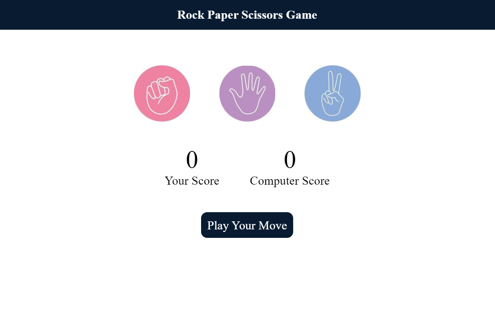
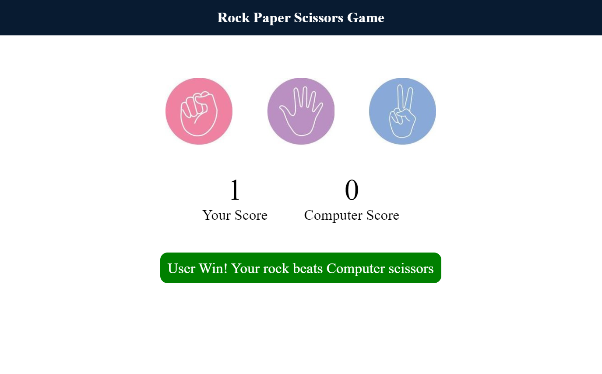

# Rock Paper Scissors Game
### Rock, Paper, Scissors is a hand game usually played between two people, where each player simultaneously forms one of three shapes with an outstretched hand:
#### Rock: A closed fist
#### Paper: A flat hand with fingers and thumb extended and the palm facing downward
#### Scissors: A fist with the index and middle fingers fully extended toward the opposing player

### The Rules are
#### Rock beats scissors
#### Paper beats rock
#### Scissors beats paper
#### If both players throw the same hand signal, it is considered a tie, and play resumes until there is a clear winner

### Output
1. 
2. 
3. 